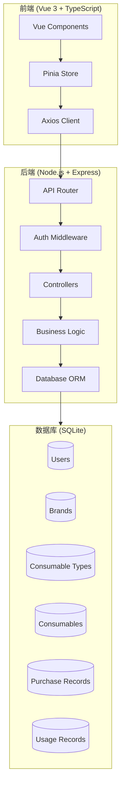
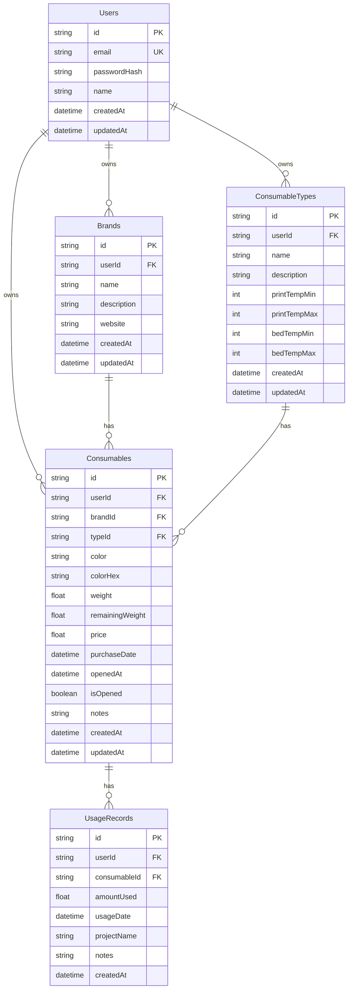

# Design Document

## Overview

3D 打印耗材管理系统采用现代 Web 应用架构，前端使用 Vue 3 + TypeScript 构建单页应用，后端使用 Node.js + Express 提供 RESTful API，数据存储使用 SQLite（便于部署和迁移）。系统支持用户认证、耗材全生命周期管理、库存追踪等功能。

## Architecture



## Components and Interfaces

### Frontend Components

#### 1. Authentication Module

```typescript
interface AuthState {
  user: User | null;
  isAuthenticated: boolean;
  isLoading: boolean;
}

interface LoginCredentials {
  email: string;
  password: string;
}

interface RegisterData {
  email: string;
  password: string;
  name: string;
}
```

#### 2. Brand Management Component

```typescript
interface Brand {
  id: string;
  name: string;
  description?: string;
  website?: string;
  userId: string;
  createdAt: Date;
  updatedAt: Date;
}

interface BrandFormData {
  name: string;
  description?: string;
  website?: string;
}
```

#### 3. Consumable Type Component

```typescript
interface ConsumableType {
  id: string;
  name: string; // e.g., "PLA", "ABS", "PETG"
  description?: string;
  printTempMin?: number; // 打印温度范围
  printTempMax?: number;
  bedTempMin?: number; // 热床温度范围
  bedTempMax?: number;
  userId: string;
  createdAt: Date;
  updatedAt: Date;
}
```

#### 4. Consumable (Inventory Item) Component

```typescript
interface Consumable {
  id: string;
  brandId: string;
  typeId: string;
  color: string; // 颜色名称
  colorHex?: string; // 颜色十六进制值
  weight: number; // 总重量(g)
  remainingWeight: number; // 剩余重量(g)
  price: number; // 购买价格
  purchaseDate: Date; // 购买日期
  openedAt?: Date; // 开封日期
  isOpened: boolean; // 是否已开封
  notes?: string;
  userId: string;
  createdAt: Date;
  updatedAt: Date;
}
```

#### 5. Purchase Record Component

```typescript
interface PurchaseRecord {
  id: string;
  consumableId: string;
  quantity: number; // 购买数量(卷)
  unitPrice: number; // 单价
  totalPrice: number; // 总价
  purchaseDate: Date;
  vendor?: string; // 购买渠道
  notes?: string;
  userId: string;
  createdAt: Date;
}
```

#### 6. Usage Record Component

```typescript
interface UsageRecord {
  id: string;
  consumableId: string;
  amountUsed: number; // 使用量(g)
  usageDate: Date;
  projectName?: string; // 打印项目名称
  notes?: string;
  userId: string;
  createdAt: Date;
}
```

### Backend API Endpoints

#### Authentication API

```
POST /api/auth/register    - 用户注册
POST /api/auth/login       - 用户登录
POST /api/auth/logout      - 用户登出
GET  /api/auth/me          - 获取当前用户信息
```

#### Brand API

```
GET    /api/brands         - 获取用户的所有品牌
POST   /api/brands         - 创建新品牌
GET    /api/brands/:id     - 获取单个品牌
PUT    /api/brands/:id     - 更新品牌
DELETE /api/brands/:id     - 删除品牌
```

#### Consumable Type API

```
GET    /api/types          - 获取用户的所有类型
POST   /api/types          - 创建新类型
GET    /api/types/:id      - 获取单个类型
PUT    /api/types/:id      - 更新类型
DELETE /api/types/:id      - 删除类型
```

#### Consumable API

```
GET    /api/consumables              - 获取用户的所有耗材
POST   /api/consumables              - 创建新耗材
GET    /api/consumables/:id          - 获取单个耗材
PUT    /api/consumables/:id          - 更新耗材
DELETE /api/consumables/:id          - 删除耗材
PATCH  /api/consumables/:id/open     - 标记耗材为已开封
```

#### Usage Record API

```
GET    /api/usages                   - 获取使用记录
POST   /api/usages                   - 创建使用记录
PUT    /api/usages/:id               - 更新使用记录
DELETE /api/usages/:id               - 删除使用记录
```

#### Dashboard API

```
GET    /api/dashboard/inventory      - 获取库存概览
GET    /api/dashboard/stats          - 获取统计数据
```

## Data Models

### Database Schema



## Correctness Properties

_A property is a characteristic or behavior that should hold true across all valid executions of a system—essentially, a formal statement about what the system should do. Properties serve as the bridge between human-readable specifications and machine-verifiable correctness guarantees._

### Property 1: User Authentication Round-Trip

_For any_ valid email and password combination, registering a user and then logging in with the same credentials should return a valid session that grants access to the user's data.

**Validates: Requirements 1.1, 1.2**

### Property 2: CRUD Operations Persistence

_For any_ entity (Brand, ConsumableType, Consumable, UsageRecord), creating it with valid data and then retrieving it should return an equivalent object with all fields preserved.

**Validates: Requirements 2.1, 2.3, 3.1, 3.3, 4.1, 4.3, 5.1, 5.3, 9.1**

### Property 3: Referential Integrity Protection

_For any_ Brand or ConsumableType that has associated Consumables, attempting to delete it should fail and return an error, while the entity remains in the database.

**Validates: Requirements 2.5, 3.5**

### Property 4: Inventory Calculation Consistency

_For any_ Consumable with initial weight W, after N usage records totaling U grams, the remaining weight should equal W - U (or 0 if U > W).

**Validates: Requirements 4.1, 4.3, 4.4, 5.1, 5.3, 5.4**

### Property 5: Filter Results Correctness

_For any_ filter criteria (brand, type, color, opened status), the returned consumables should all match the specified criteria, and no matching consumables should be excluded.

**Validates: Requirements 6.3, 7.2, 8.3**

### Property 6: User Data Isolation

_For any_ two different users A and B, user A's API requests should never return data created by user B, and vice versa.

**Validates: Requirements 9.3**

### Property 7: Aggregation Calculation Correctness

_For any_ set of consumables, the total weight per category (brand/type/color) should equal the sum of individual remaining weights in that category.

**Validates: Requirements 4.5, 7.1, 7.3**

### Property 8: Opening Status Duration Calculation

_For any_ opened consumable with openedAt timestamp T, the duration since opening should equal the difference between current time and T.

**Validates: Requirements 6.1, 6.4**

## Error Handling

### Authentication Errors

| Error Code | Condition                | Response                              |
| ---------- | ------------------------ | ------------------------------------- |
| 401        | Invalid credentials      | "Invalid email or password"           |
| 401        | Session expired          | "Session expired, please login again" |
| 409        | Email already registered | "Email already in use"                |

### Validation Errors

| Error Code | Condition               | Response                        |
| ---------- | ----------------------- | ------------------------------- |
| 400        | Missing required fields | "Field {fieldName} is required" |
| 400        | Invalid email format    | "Invalid email format"          |
| 400        | Invalid color hex code  | "Invalid color format"          |
| 400        | Negative weight/price   | "Weight/Price must be positive" |

### Business Logic Errors

| Error Code | Condition                     | Response                                        |
| ---------- | ----------------------------- | ----------------------------------------------- |
| 409        | Delete brand with consumables | "Cannot delete brand with existing consumables" |
| 409        | Delete type with consumables  | "Cannot delete type with existing consumables"  |
| 404        | Entity not found              | "{Entity} not found"                            |
| 403        | Access to other user's data   | "Access denied"                                 |

### Warning Conditions (Non-blocking)

| Condition                      | Warning Message                                     |
| ------------------------------ | --------------------------------------------------- |
| Usage exceeds remaining weight | "Warning: Usage amount exceeds remaining inventory" |
| Low stock threshold reached    | "Low stock alert: {consumable} below threshold"     |

## Testing Strategy

### Testing Framework

- **Backend**: Jest with Supertest for API testing
- **Property-Based Testing**: fast-check library for TypeScript
- **Frontend**: Vue Test Utils with Vitest

### Unit Tests

Unit tests will cover:

- Input validation functions
- Date calculation utilities
- Color parsing and validation
- Aggregation calculation functions
- Authentication token handling

### Property-Based Tests

Each correctness property will be implemented as a property-based test using fast-check:

1. **Property 1 (Auth Round-Trip)**: Generate random valid emails and passwords, verify registration and login flow
2. **Property 2 (CRUD Persistence)**: Generate random entity data, verify create-read consistency
3. **Property 3 (Referential Integrity)**: Generate entities with references, verify deletion protection
4. **Property 4 (Inventory Calculation)**: Generate random usage sequences, verify remaining weight calculation
5. **Property 5 (Filter Correctness)**: Generate random filter criteria, verify result set correctness
6. **Property 6 (Data Isolation)**: Generate operations for multiple users, verify no data leakage
7. **Property 7 (Aggregation)**: Generate random consumable sets, verify sum calculations
8. **Property 8 (Duration Calculation)**: Generate random timestamps, verify duration calculation

### Test Configuration

- Minimum 100 iterations per property test
- Each property test tagged with: **Feature: 3d-printing-consumables-manager, Property {N}: {property_text}**
- Tests run in isolated database transactions (rollback after each test)

### Integration Tests

- Full API flow tests for each user story
- Authentication flow end-to-end
- Inventory update cascade verification
