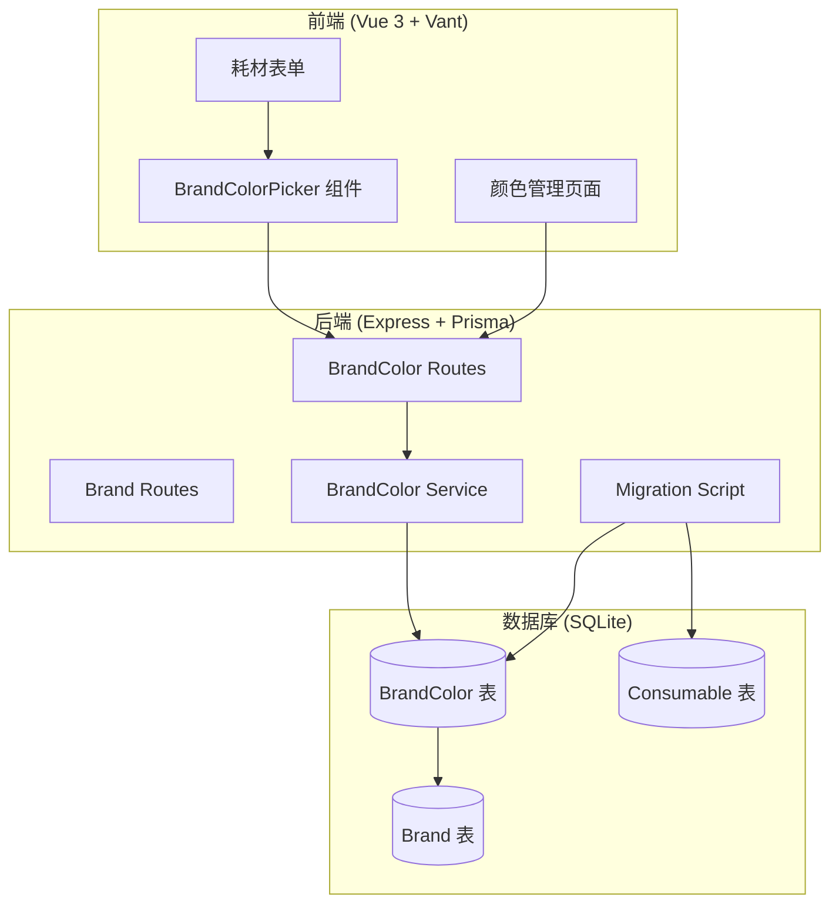
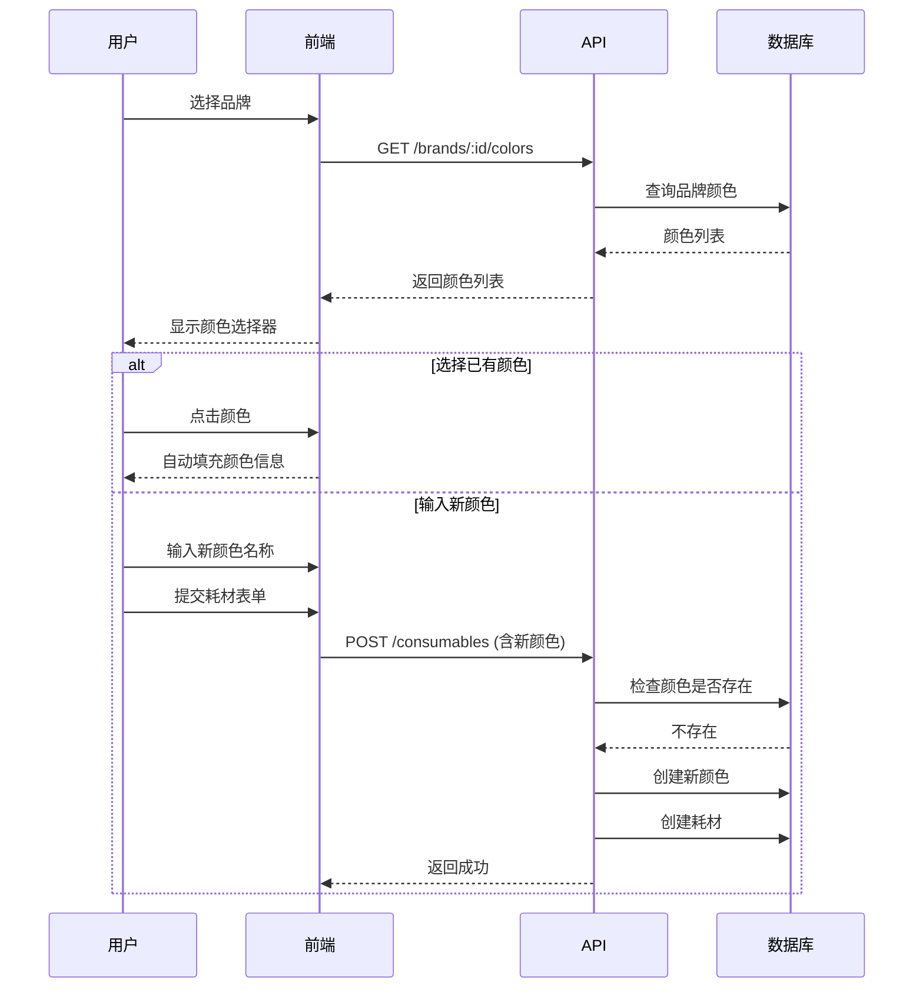

# 设计文档：品牌颜色管理

## 概述

品牌颜色管理功能为 3D 打印耗材管理系统添加颜色标准化能力。通过为每个品牌维护独立的颜色库，用户可以在添加耗材时快速选择已有颜色，同时支持新颜色的自动入库，从而避免颜色命名不一致的问题。

### 核心设计理念

1. **渐进式增强**：不破坏现有功能，颜色选择为可选增强
2. **数据一致性**：通过颜色库统一命名，减少"白色"/"白"等重复
3. **用户体验优先**：选择已有颜色比手动输入更快捷

## 架构

### 系统架构图



### 数据流



## 组件和接口

### 后端组件

#### 1. BrandColor Service

```typescript
// backend/src/services/brandColor.service.ts

interface BrandColor {
  id: string;
  brandId: string;
  userId: string;
  colorName: string;
  colorHex: string;
  createdAt: Date;
  updatedAt: Date;
}

interface CreateBrandColorInput {
  colorName: string;
  colorHex: string;
}

interface UpdateBrandColorInput {
  colorName?: string;
  colorHex?: string;
}

class BrandColorService {
  // 获取品牌下所有颜色
  static async findAllByBrand(
    userId: string,
    brandId: string,
  ): Promise<BrandColor[]>;

  // 创建品牌颜色
  static async create(
    userId: string,
    brandId: string,
    data: CreateBrandColorInput,
  ): Promise<BrandColor>;

  // 更新品牌颜色
  static async update(
    userId: string,
    brandId: string,
    colorId: string,
    data: UpdateBrandColorInput,
  ): Promise<BrandColor>;

  // 删除品牌颜色
  static async delete(
    userId: string,
    brandId: string,
    colorId: string,
  ): Promise<void>;

  // 根据颜色名称查找（用于去重）
  static async findByName(
    userId: string,
    brandId: string,
    colorName: string,
  ): Promise<BrandColor | null>;

  // 批量创建（用于迁移）
  static async createMany(
    userId: string,
    brandId: string,
    colors: CreateBrandColorInput[],
  ): Promise<number>;
}
```

#### 2. BrandColor Routes

```typescript
// backend/src/routes/brandColor.routes.ts

// GET /api/brands/:brandId/colors - 获取品牌颜色列表
// POST /api/brands/:brandId/colors - 创建品牌颜色
// PUT /api/brands/:brandId/colors/:colorId - 更新品牌颜色
// DELETE /api/brands/:brandId/colors/:colorId - 删除品牌颜色
```

#### 3. 迁移脚本

```typescript
// backend/src/scripts/migrateBrandColors.ts

interface MigrationResult {
  totalConsumables: number;
  uniqueColors: number;
  colorsCreated: number;
  errors: string[];
}

async function migrateBrandColors(): Promise<MigrationResult>;
```

### 前端组件

#### 1. BrandColorPicker 组件

```typescript
// frontend/src/components/mobile/BrandColorPicker.vue

interface BrandColor {
  id: string;
  colorName: string;
  colorHex: string;
}

interface Props {
  brandId: string; // 当前选中的品牌ID
  modelValue: string; // 当前颜色名称 (v-model)
  colorHex: string; // 当前颜色代码
}

interface Emits {
  "update:modelValue": (value: string) => void;
  "update:colorHex": (value: string) => void;
  select: (color: BrandColor) => void;
}
```

#### 2. BrandColor Store

```typescript
// frontend/src/stores/brandColor.ts

interface BrandColorState {
  colors: Map<string, BrandColor[]>; // brandId -> colors
  isLoading: boolean;
  error: string | null;
}

interface BrandColorStore {
  // 获取品牌颜色
  fetchColors(brandId: string): Promise<boolean>;

  // 创建颜色
  createColor(
    brandId: string,
    data: CreateBrandColorInput,
  ): Promise<BrandColor | null>;

  // 更新颜色
  updateColor(
    brandId: string,
    colorId: string,
    data: UpdateBrandColorInput,
  ): Promise<BrandColor | null>;

  // 删除颜色
  deleteColor(brandId: string, colorId: string): Promise<boolean>;

  // 获取缓存的颜色列表
  getColors(brandId: string): BrandColor[];

  // 检查颜色是否存在
  colorExists(brandId: string, colorName: string): boolean;
}
```

## 数据模型

### 数据库 Schema 变更

```prisma
// 新增 BrandColor 模型
model BrandColor {
  id        String   @id @default(uuid())
  userId    String
  brandId   String
  colorName String
  colorHex  String   @default("#CCCCCC")
  createdAt DateTime @default(now())
  updatedAt DateTime @updatedAt

  // Relations
  user  User  @relation(fields: [userId], references: [id], onDelete: Cascade)
  brand Brand @relation(fields: [brandId], references: [id], onDelete: Cascade)

  @@unique([brandId, colorName])
  @@index([brandId])
}

// 更新 User 模型，添加关联
model User {
  // ... 现有字段
  brandColors BrandColor[]
}

// 更新 Brand 模型，添加关联
model Brand {
  // ... 现有字段
  colors BrandColor[]
}
```

### API 响应格式

```typescript
// 颜色列表响应
interface BrandColorsResponse {
  success: boolean;
  data?: BrandColor[];
  error?: string;
}

// 单个颜色响应
interface BrandColorResponse {
  success: boolean;
  data?: BrandColor;
  error?: string;
}

// 迁移结果响应
interface MigrationResponse {
  success: boolean;
  data?: {
    totalConsumables: number;
    uniqueColors: number;
    colorsCreated: number;
  };
  error?: string;
}
```

## 正确性属性

_正确性属性是系统在所有有效执行中都应保持为真的特征或行为——本质上是关于系统应该做什么的形式化陈述。属性作为人类可读规范和机器可验证正确性保证之间的桥梁。_

### Property 1: 颜色创建验证

_对于任意_ 颜色创建请求，如果 colorName 为空或 colorHex 不是有效的十六进制颜色格式，系统应拒绝创建并返回错误；如果同一品牌下已存在相同 colorName，系统应拒绝创建并返回重复错误。

**验证: 需求 1.2, 1.3**

### Property 2: 品牌删除级联

_对于任意_ 品牌，当该品牌被删除时，该品牌下的所有颜色记录也应被删除，查询该品牌的颜色列表应返回空。

**验证: 需求 1.4**

### Property 3: 颜色列表排序

_对于任意_ 品牌的颜色列表查询，返回的颜色应按 colorName 字母顺序升序排列。

**验证: 需求 1.5**

### Property 4: 权限隔离

_对于任意_ 用户 A 和用户 B，用户 A 不能查看、创建、修改或删除用户 B 的品牌颜色。

**验证: 需求 2.5**

### Property 5: 品牌切换清空状态

_对于任意_ 颜色选择器状态，当用户切换品牌时，已选择的颜色应被清空，颜色列表应更新为新品牌的颜色。

**验证: 需求 3.3**

### Property 6: 新颜色自动添加幂等性

_对于任意_ 耗材创建请求，如果颜色名称不在品牌颜色库中，该颜色应被自动添加；如果颜色名称已存在，不应创建重复记录。多次提交相同颜色名称的耗材，品牌颜色库中该颜色只有一条记录。

**验证: 需求 4.1, 4.4**

### Property 7: 迁移数据完整性

_对于任意_ 现有耗材数据集，迁移后：

- 每个唯一的 (brandId, colorName) 组合在 BrandColor 表中有且仅有一条记录
- 如果原耗材有 colorHex 值，迁移后的颜色记录使用该值；否则使用默认值 #CCCCCC

**验证: 需求 6.2, 6.3, 6.4**

## 错误处理

### 后端错误处理

| 错误场景         | HTTP 状态码 | 错误信息                  |
| ---------------- | ----------- | ------------------------- |
| 品牌不存在       | 404         | Brand not found           |
| 颜色不存在       | 404         | Color not found           |
| 颜色名称为空     | 400         | Color name is required    |
| 颜色代码格式无效 | 400         | Invalid color hex format  |
| 颜色名称重复     | 409         | Color name already exists |
| 无权限访问       | 403         | Access denied             |
| 未认证           | 401         | Not authenticated         |

### 前端错误处理

1. **网络错误**: 显示 Toast 提示"网络错误，请重试"
2. **验证错误**: 在表单字段下方显示错误信息
3. **权限错误**: 显示 Toast 提示并返回上一页
4. **颜色自动添加失败**: 显示 Toast 提示但不阻止耗材保存

## 测试策略

### 单元测试

1. **BrandColorService 测试**
   - 测试 CRUD 操作的正确性
   - 测试验证逻辑（空名称、无效颜色代码）
   - 测试唯一性约束

2. **BrandColor Store 测试**
   - 测试状态管理逻辑
   - 测试缓存机制
   - 测试 colorExists 方法

### 属性测试

使用 fast-check 进行属性测试，每个测试运行至少 100 次迭代。

1. **颜色创建验证属性测试**
   - 生成随机的 colorName 和 colorHex
   - 验证有效输入被接受，无效输入被拒绝
   - **Feature: brand-color-management, Property 1: 颜色创建验证**

2. **颜色列表排序属性测试**
   - 生成随机颜色列表
   - 验证返回结果按字母顺序排序
   - **Feature: brand-color-management, Property 3: 颜色列表排序**

3. **新颜色自动添加幂等性测试**
   - 生成随机颜色名称
   - 多次创建相同颜色的耗材
   - 验证颜色库中只有一条记录
   - **Feature: brand-color-management, Property 6: 新颜色自动添加幂等性**

4. **迁移数据完整性测试**
   - 生成随机耗材数据集
   - 执行迁移
   - 验证颜色记录的唯一性和 colorHex 值
   - **Feature: brand-color-management, Property 7: 迁移数据完整性**

### 集成测试

1. **API 端到端测试**
   - 测试完整的 CRUD 流程
   - 测试权限控制
   - 测试级联删除

2. **前端 E2E 测试 (Playwright)**
   - 测试颜色选择器交互
   - 测试新颜色自动添加流程
   - 测试颜色管理界面操作
