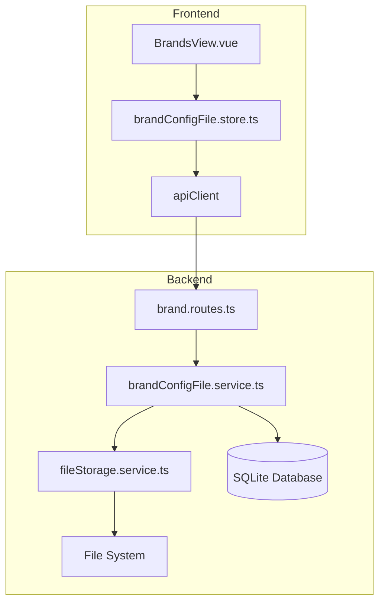

# Design Document: 品牌配置文件上传

## Overview

本设计为品牌管理模块添加配置文件上传功能。用户可以为每个品牌上传多个配置文件（如 3D 打印机配置、切片软件参数等），系统不限制文件类型。

技术方案采用本地文件系统存储，配合数据库记录文件元数据。前端使用 Vue 3 + Pinia，后端使用 Express + Prisma + SQLite。

## Architecture



### 文件存储策略

- 存储位置：`uploads/brand-configs/{userId}/{brandId}/{fileId}_{originalName}`
- 使用 UUID 作为文件 ID 前缀，避免文件名冲突
- 保留原始文件名用于下载时恢复

## Components and Interfaces

### 1. 数据库模型 (Prisma Schema)

```prisma
model BrandConfigFile {
  id           String   @id @default(uuid())
  userId       String
  brandId      String
  fileName     String   // 原始文件名
  fileSize     Int      // 文件大小（字节）
  storagePath  String   // 存储路径
  createdAt    DateTime @default(now())

  // Relations
  user  User  @relation(fields: [userId], references: [id], onDelete: Cascade)
  brand Brand @relation(fields: [brandId], references: [id], onDelete: Cascade)
}
```

### 2. 后端服务接口

```typescript
// brandConfigFile.service.ts
interface BrandConfigFileResponse {
  id: string;
  brandId: string;
  fileName: string;
  fileSize: number;
  createdAt: Date;
}

class BrandConfigFileService {
  // 上传文件
  static async upload(
    userId: string,
    brandId: string,
    file: Express.Multer.File
  ): Promise<BrandConfigFileResponse>;

  // 获取品牌下所有文件
  static async findByBrand(
    userId: string,
    brandId: string
  ): Promise<BrandConfigFileResponse[]>;

  // 下载文件（返回文件路径）
  static async getFilePath(
    userId: string,
    fileId: string
  ): Promise<{ path: string; fileName: string }>;

  // 删除文件
  static async delete(userId: string, fileId: string): Promise<void>;
}
```

### 3. API 路由

| Method | Endpoint                            | Description                |
| ------ | ----------------------------------- | -------------------------- |
| POST   | `/api/brands/:brandId/files`        | 上传配置文件（支持多文件） |
| GET    | `/api/brands/:brandId/files`        | 获取品牌配置文件列表       |
| GET    | `/api/brand-files/:fileId/download` | 下载配置文件               |
| DELETE | `/api/brand-files/:fileId`          | 删除配置文件               |

### 4. 前端 Store

```typescript
// brandConfigFile.store.ts
interface BrandConfigFile {
  id: string;
  brandId: string;
  fileName: string;
  fileSize: number;
  createdAt: string;
}

interface BrandConfigFileStore {
  files: BrandConfigFile[];
  isLoading: boolean;
  error: string | null;

  fetchFiles(brandId: string): Promise<boolean>;
  uploadFiles(brandId: string, files: File[]): Promise<boolean>;
  downloadFile(fileId: string, fileName: string): Promise<void>;
  deleteFile(fileId: string): Promise<boolean>;
}
```

## Data Models

### BrandConfigFile 实体

| Field       | Type     | Description         |
| ----------- | -------- | ------------------- |
| id          | UUID     | 主键                |
| userId      | UUID     | 所属用户 ID（外键） |
| brandId     | UUID     | 所属品牌 ID（外键） |
| fileName    | String   | 原始文件名          |
| fileSize    | Integer  | 文件大小（字节）    |
| storagePath | String   | 文件存储路径        |
| createdAt   | DateTime | 创建时间            |

### 文件存储结构

```
uploads/
└── brand-configs/
    └── {userId}/
        └── {brandId}/
            ├── {fileId}_config1.json
            ├── {fileId}_profile.ini
            └── {fileId}_settings.xml
```

## Correctness Properties

_A property is a characteristic or behavior that should hold true across all valid executions of a system-essentially, a formal statement about what the system should do. Properties serve as the bridge between human-readable specifications and machine-verifiable correctness guarantees._

### Property 1: 文件上传创建数据库记录

_For any_ 有效的文件和品牌 ID，上传文件后，数据库中应存在对应的 BrandConfigFile 记录，且记录的 brandId、fileName、fileSize 与上传参数一致。

**Validates: Requirements 1.1, 1.5**

### Property 2: 文件类型无限制

_For any_ 文件扩展名或 MIME 类型，系统都应接受上传请求并成功存储文件。

**Validates: Requirements 1.2**

### Property 3: 上传返回完整元数据

_For any_ 成功上传的文件，返回的响应应包含 id、fileName、fileSize、createdAt 字段，且值与实际文件一致。

**Validates: Requirements 1.3**

### Property 4: 文件列表完整性

_For any_ 品牌，查询该品牌的文件列表应返回所有已上传的文件，且每个文件包含 fileName、fileSize、createdAt 字段。

**Validates: Requirements 2.1, 2.2**

### Property 5: 文件下载 Round-Trip

_For any_ 上传的文件，下载后的内容应与原始上传内容完全一致，且下载时的文件名应与原始文件名一致。

**Validates: Requirements 3.1**

### Property 6: 用户数据隔离

_For any_ 两个不同的用户 A 和 B，用户 A 上传的文件不应出现在用户 B 的查询结果中，用户 B 也不能下载或删除用户 A 的文件。

**Validates: Requirements 3.3, 4.3, 5.1**

### Property 7: 删除移除文件和记录

_For any_ 已上传的文件，删除操作后，数据库记录应被移除，且文件系统中的物理文件也应被删除。

**Validates: Requirements 4.1**

### Property 8: 品牌删除级联

_For any_ 品牌，当品牌被删除时，该品牌下的所有配置文件记录和物理文件都应被删除。

**Validates: Requirements 5.2**

## Error Handling

| 场景         | HTTP Status | 错误信息           |
| ------------ | ----------- | ------------------ |
| 品牌不存在   | 404         | Brand not found    |
| 文件不存在   | 404         | File not found     |
| 无权访问     | 403         | Access denied      |
| 文件上传失败 | 500         | File upload failed |
| 文件过大     | 413         | File too large     |

### 文件大小限制

- 单个文件最大：50MB
- 使用 multer 中间件进行限制

## Testing Strategy

### 单元测试

- 测试 BrandConfigFileService 的各个方法
- 测试文件存储路径生成逻辑
- 测试权限验证逻辑

### 属性测试

使用 fast-check 库进行属性测试：

- 每个属性测试运行至少 100 次迭代
- 测试标签格式：**Feature: brand-config-files, Property {number}: {property_text}**

### 测试框架

- 后端：Jest + fast-check
- 前端：Vitest（如需要）

### 边界情况测试

- 空文件上传
- 超大文件上传
- 特殊字符文件名
- 并发上传同名文件
