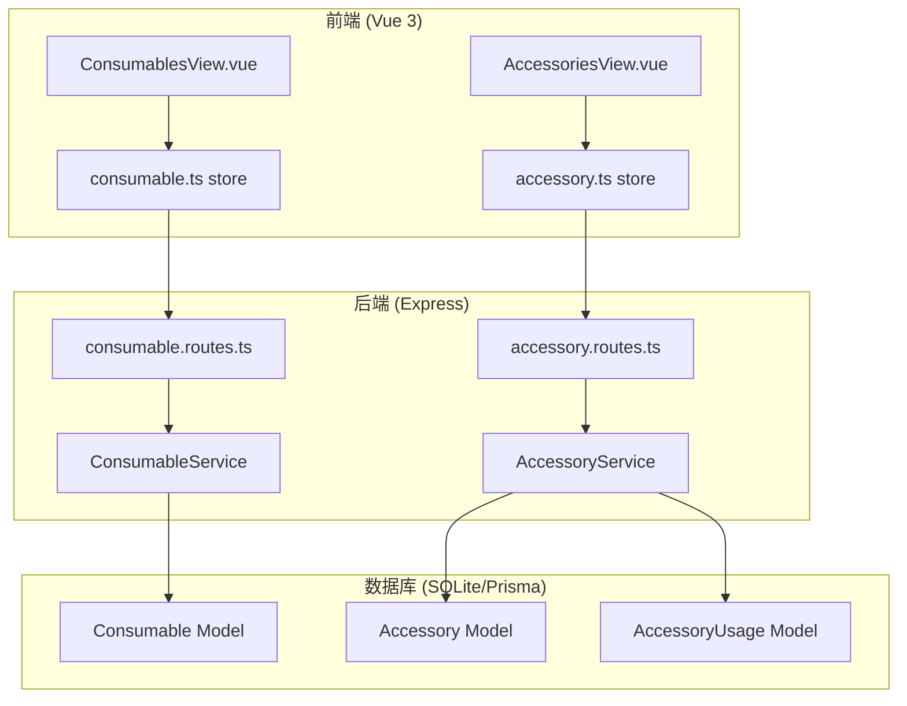
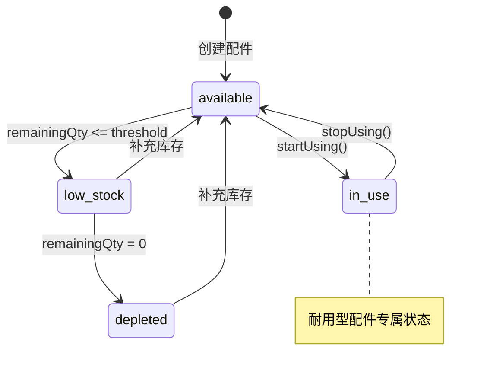
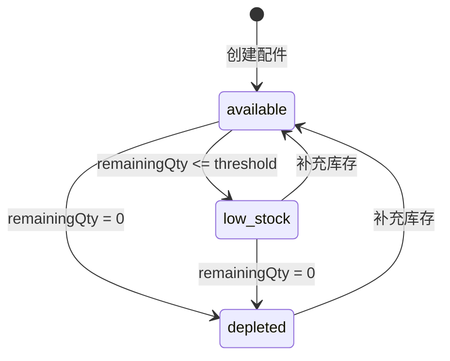

# 设计文档

## 概述

本设计文档描述了 3D 打印耗材管理系统的功能增强，包括批量添加耗材、耗材开封状态设置、以及配件使用状态优化。系统采用 Vue 3 + TypeScript 前端和 Express + Prisma 后端架构。

## 架构

### 系统架构图



### 数据流

1. **批量添加耗材**: UI → Store → API → Service → Database (事务)
2. **设置开封状态**: UI → Store → API → Service → Database
3. **配件使用状态**: UI → Store → API → Service → Database (状态机)

## 组件和接口

### 后端接口变更

#### ConsumableService 扩展

```typescript
// 批量创建耗材数据接口
interface BatchCreateConsumableData {
  brandId: string;
  typeId: string;
  color: string;
  colorHex?: string;
  weight: number;
  price: number;
  purchaseDate: Date;
  notes?: string;
  quantity: number; // 新增：批量数量
  isOpened?: boolean; // 新增：开封状态
  openedAt?: Date; // 新增：开封日期
}

// 批量创建响应
interface BatchCreateResponse {
  consumables: ConsumableResponse[];
  count: number;
}

// ConsumableService 新增方法
class ConsumableService {
  // 批量创建耗材
  static async batchCreate(
    userId: string,
    data: BatchCreateConsumableData
  ): Promise<BatchCreateResponse>;
}
```

#### AccessoryService 扩展

```typescript
// 配件使用类型
type AccessoryUsageType = "consumable" | "durable";

// 配件状态扩展
type AccessoryStatus = "available" | "in_use" | "low_stock" | "depleted";

// 创建配件数据扩展
interface CreateAccessoryData {
  // ... 现有字段
  usageType?: AccessoryUsageType; // 新增：使用类型，默认 'consumable'
}

// AccessoryService 新增方法
class AccessoryService {
  // 开始使用耐用型配件
  static async startUsing(
    userId: string,
    accessoryId: string
  ): Promise<AccessoryResponse>;

  // 结束使用耐用型配件
  static async stopUsing(
    userId: string,
    accessoryId: string,
    notes?: string
  ): Promise<AccessoryResponse>;
}
```

### 前端接口变更

#### Consumable Store 扩展

```typescript
// 批量创建表单数据
interface BatchConsumableFormData extends ConsumableFormData {
  quantity: number;
  isOpened: boolean;
  openedAt?: string;
}

// Store 新增方法
const useConsumableStore = defineStore("consumable", () => {
  // 批量创建耗材
  async function batchCreateConsumable(
    data: BatchConsumableFormData
  ): Promise<ConsumableResponse[] | null>;
});
```

#### Accessory Store 扩展

```typescript
// 配件状态常量扩展
const ACCESSORY_STATUS = {
  available: "可用",
  in_use: "使用中",
  low_stock: "库存不足",
  depleted: "已耗尽",
};

// Store 新增方法
const useAccessoryStore = defineStore("accessory", () => {
  // 开始使用配件
  async function startUsing(id: string): Promise<AccessoryResponse | null>;

  // 结束使用配件
  async function stopUsing(
    id: string,
    notes?: string
  ): Promise<AccessoryResponse | null>;
});
```

## 数据模型

### Prisma Schema 变更

```prisma
model Consumable {
  // ... 现有字段保持不变
  // isOpened 和 openedAt 已存在，无需修改
}

model Accessory {
  id               String    @id @default(uuid())
  userId           String
  categoryId       String
  name             String
  brand            String?
  model            String?
  price            Float?
  purchaseDate     DateTime?
  quantity         Int       @default(1)
  remainingQty     Int       @default(1)
  replacementCycle Int?
  lastReplacedAt   DateTime?
  lowStockThreshold Int?
  status           String    @default("available")
  usageType        String    @default("consumable")  // 新增：使用类型
  inUseStartedAt   DateTime?                         // 新增：开始使用时间
  notes            String?
  createdAt        DateTime  @default(now())
  updatedAt        DateTime  @updatedAt

  // Relations
  user         User              @relation(fields: [userId], references: [id], onDelete: Cascade)
  category     AccessoryCategory @relation(fields: [categoryId], references: [id], onDelete: Restrict)
  usageRecords AccessoryUsage[]
}

model AccessoryUsage {
  id          String   @id @default(uuid())
  userId      String
  accessoryId String
  usageDate   DateTime
  quantity    Int
  purpose     String?
  duration    Int?     // 新增：使用时长（分钟），用于耐用型配件
  createdAt   DateTime @default(now())

  // Relations
  user      User      @relation(fields: [userId], references: [id], onDelete: Cascade)
  accessory Accessory @relation(fields: [accessoryId], references: [id], onDelete: Cascade)
}
```

### 状态机设计

#### 耐用型配件状态转换



#### 消耗型配件状态转换



## 正确性属性

_正确性属性是系统在所有有效执行中应保持为真的特征或行为。属性作为人类可读规范和机器可验证正确性保证之间的桥梁。_

### 属性 1：批量创建数量一致性

_对于任意_ 批量创建请求，指定数量为 N 时，创建成功后应该产生恰好 N 条独立的耗材记录，且每条记录具有唯一的 ID。

**验证: 需求 1.1, 1.2**

### 属性 2：批量创建属性共享

_对于任意_ 批量创建的耗材记录集合，所有记录应该共享相同的品牌 ID、类型 ID、颜色、颜色代码、重量、价格和购买日期。

**验证: 需求 1.3**

### 属性 3：批量创建事务原子性

_对于任意_ 批量创建操作，如果过程中发生错误，数据库中不应该存在任何该批次的部分记录（全部成功或全部失败）。

**验证: 需求 1.4**

### 属性 4：开封状态默认值

_对于任意_ 创建的耗材，当 isOpened 为 true 且未指定 openedAt 时，openedAt 应该被设置为当前日期；当 isOpened 为 false 时，openedAt 应该为 null。

**验证: 需求 2.3, 2.4**

### 属性 5：批量创建开封状态一致性

_对于任意_ 批量创建的耗材记录集合，所有记录的 isOpened 和 openedAt 字段应该具有相同的值。

**验证: 需求 2.5**

### 属性 6：配件使用类型有效性

_对于任意_ 配件记录，usageType 字段的值必须是"consumable"或"durable"之一。

**验证: 需求 3.1**

### 属性 7：耐用型配件状态转换

_对于任意_ usageType 为"durable"的配件，调用 startUsing 后状态应该变为"in_use"且 inUseStartedAt 应该被设置；调用 stopUsing 后状态应该恢复为"available"且应该创建一条使用记录。

**验证: 需求 3.3, 4.2, 4.4**

### 属性 8：消耗型配件数量递减

_对于任意_ usageType 为"consumable"的配件，记录使用后 remainingQty 应该减少相应的数量，且状态应该根据剩余数量和阈值正确更新。

**验证: 需求 3.4**

### 属性 9：使用中配件删除保护

_对于任意_ 状态为"in_use"的配件，删除操作应该失败并返回错误。

**验证: 需求 4.6**

## 错误处理

### 批量创建耗材错误

| 错误场景       | 错误消息                       | HTTP 状态码 |
| -------------- | ------------------------------ | ----------- |
| 数量小于 1     | "Quantity must be at least 1"  | 400         |
| 品牌不存在     | "Brand not found"              | 404         |
| 类型不存在     | "Consumable type not found"    | 404         |
| 数据库事务失败 | "Failed to create consumables" | 500         |

### 配件状态操作错误

| 错误场景                        | 错误消息                                           | HTTP 状态码 |
| ------------------------------- | -------------------------------------------------- | ----------- |
| 非耐用型配件调用 startUsing     | "Only durable accessories can be marked as in use" | 400         |
| 已在使用中的配件再次 startUsing | "Accessory is already in use"                      | 400         |
| 非使用中配件调用 stopUsing      | "Accessory is not in use"                          | 400         |
| 删除使用中的配件                | "Cannot delete accessory that is in use"           | 400         |

## 测试策略

### 单元测试

单元测试用于验证特定示例和边界情况：

1. **批量创建边界测试**

   - 数量为 1 时的创建（边界情况）
   - 数量为 100 时的创建（大批量）
   - 数量为 0 或负数时的错误处理

2. **开封状态测试**

   - 默认未开封状态
   - 已开封但无日期时使用当前日期
   - 已开封且指定日期

3. **配件状态转换测试**
   - 耐用型配件的完整状态转换流程
   - 消耗型配件的状态转换
   - 无效状态转换的错误处理

### 属性测试

使用 fast-check 库进行属性测试，每个属性测试至少运行 100 次迭代。

测试标签格式: **Feature: consumable-accessory-enhancements, Property {number}: {property_text}**

属性测试覆盖：

- 属性 1-3: 批量创建相关属性
- 属性 4-5: 开封状态相关属性
- 属性 6-9: 配件使用类型和状态相关属性
