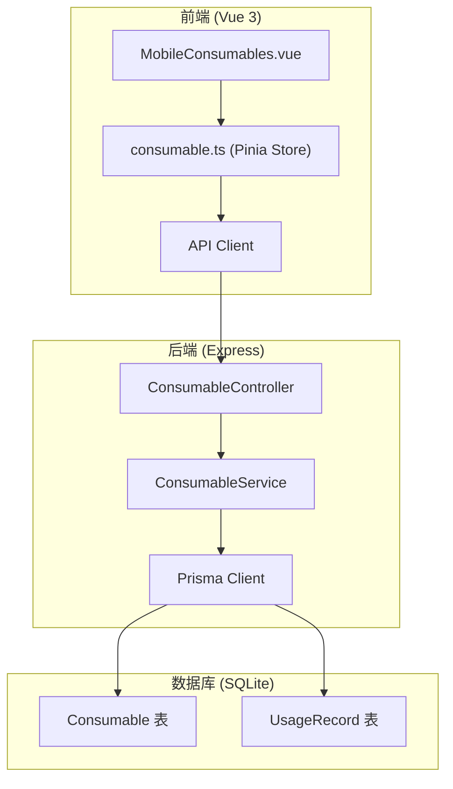
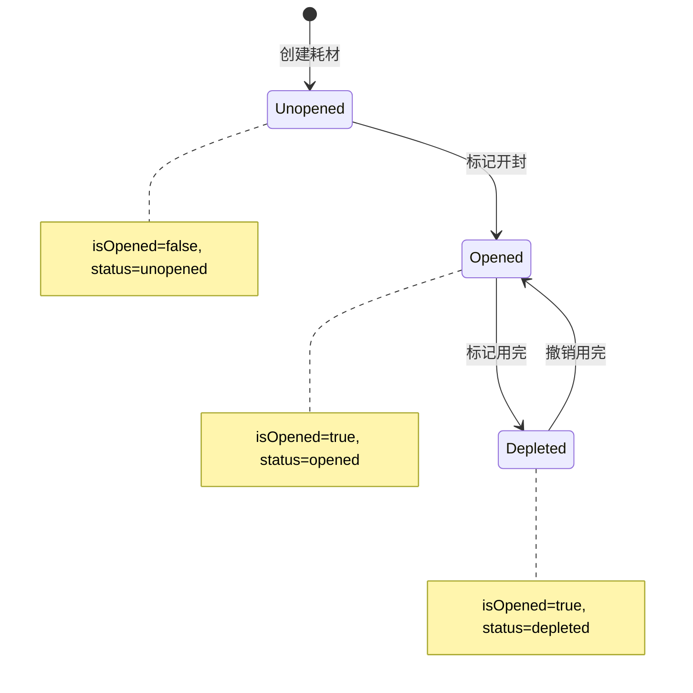

# 技术设计文档

## 概述

本设计文档描述了3D打印耗材管理系统中耗材状态管理功能的技术实现方案。核心改进包括：

1. 扩展耗材状态模型，新增"已用完"（depleted）状态
2. 实现状态转换逻辑和API接口
3. 优化前端列表显示和筛选功能
4. 确保数据保留以支持统计分析

技术栈：

- 前端：Vue 3 + TypeScript + Vite + Vant UI
- 后端：Node.js + Express + Prisma + SQLite
- 状态管理：Pinia

## 架构

### 系统架构图



### 状态流转图



## 组件和接口

### 数据库模型变更

#### Consumable 表扩展

```prisma
model Consumable {
  // 现有字段...
  id              String    @id @default(uuid())
  userId          String
  brandId         String
  typeId          String
  color           String
  colorHex        String?
  weight          Float
  remainingWeight Float
  price           Float
  purchaseDate    DateTime
  openedAt        DateTime?
  isOpened        Boolean   @default(false)
  notes           String?
  createdAt       DateTime  @default(now())
  updatedAt       DateTime  @updatedAt

  // 新增字段
  status          String    @default("unopened")  // unopened, opened, depleted
  depletedAt      DateTime?                       // 用完时间
}
```

### 后端 API 接口

#### 1. 标记耗材为已用完

```
PATCH /api/consumables/:id/deplete
```

请求体：

```typescript
interface DepleteRequest {
  depletedAt?: string; // 可选，默认为当前时间
}
```

响应：

```typescript
interface ConsumableResponse {
  success: boolean;
  data?: Consumable;
  error?: string;
}
```

#### 2. 撤销已用完状态

```
PATCH /api/consumables/:id/restore
```

响应：

```typescript
interface ConsumableResponse {
  success: boolean;
  data?: Consumable;
  error?: string;
}
```

#### 3. 获取耗材列表（增强筛选）

```
GET /api/consumables?status=opened&includeDepleted=false
```

查询参数：

```typescript
interface ConsumableFilters {
  brandId?: string;
  typeId?: string;
  color?: string;
  isOpened?: boolean;
  status?: "unopened" | "opened" | "depleted"; // 新增
  includeDepleted?: boolean; // 新增，默认 false
}
```

### 前端组件接口

#### ConsumableStore 扩展

```typescript
// 新增状态常量
export const CONSUMABLE_STATUS = {
  unopened: "未开封",
  opened: "已开封",
  depleted: "已用完",
} as const;

// 扩展 Consumable 接口
export interface Consumable {
  // 现有字段...
  status: "unopened" | "opened" | "depleted"; // 新增
  depletedAt: string | null; // 新增
}

// 扩展筛选接口
export interface ConsumableFilters {
  brandId?: string;
  typeId?: string;
  color?: string;
  isOpened?: boolean;
  status?: "unopened" | "opened" | "depleted"; // 新增
  includeDepleted?: boolean; // 新增
}

// 新增方法
async function markAsDepleted(
  id: string,
  depletedAt?: string,
): Promise<Consumable | null>;
async function restoreFromDepleted(id: string): Promise<Consumable | null>;
```

### 服务层接口

```typescript
// ConsumableService
interface IConsumableService {
  // 现有方法...

  // 新增方法
  markAsDepleted(
    id: string,
    userId: string,
    depletedAt?: Date,
  ): Promise<Consumable>;
  restoreFromDepleted(id: string, userId: string): Promise<Consumable>;
  getConsumables(
    userId: string,
    filters: ConsumableFilters,
  ): Promise<Consumable[]>;
}
```

## 数据模型

### 状态枚举

```typescript
enum ConsumableStatus {
  UNOPENED = "unopened", // 未开封
  OPENED = "opened", // 已开封
  DEPLETED = "depleted", // 已用完
}
```

### 状态转换规则

| 当前状态 | 目标状态 | 操作                | 条件 |
| -------- | -------- | ------------------- | ---- |
| unopened | opened   | markAsOpened        | 无   |
| opened   | depleted | markAsDepleted      | 无   |
| depleted | opened   | restoreFromDepleted | 无   |

### 数据迁移策略

1. 添加 `status` 字段，默认值为 `'unopened'`
2. 添加 `depletedAt` 字段，允许为空
3. 迁移现有数据：
   - `isOpened = false` → `status = 'unopened'`
   - `isOpened = true` → `status = 'opened'`
4. 保持 `isOpened` 字段向后兼容
