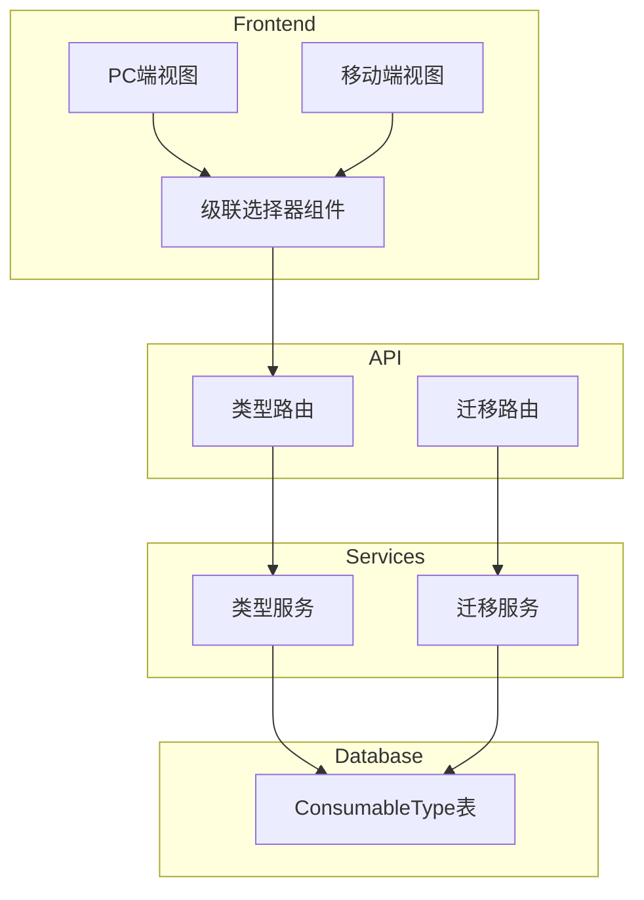

# 设计文档

## 概述

本设计将现有的单级耗材类型系统改造为两级分类结构。采用自引用模式（parentId）在现有 ConsumableType 表上实现层级关系，最大程度减少数据库结构变更和代码改动。

### 设计决策

1. **自引用模式 vs 新建大类表**：选择自引用模式，因为：
   - 减少数据库表数量
   - 简化查询逻辑
   - 保持现有外键关系不变
   - 更灵活，未来可扩展为多级分类

2. **迁移策略**：采用增量迁移，先创建大类，再更新小类的 parentId

## 架构



## 组件和接口

### 数据库层

#### ConsumableType 表结构变更

```prisma
model ConsumableType {
  id          String   @id @default(uuid())
  userId      String
  name        String
  description String?
  parentId    String?  // 新增：父类型ID，null表示大类
  createdAt   DateTime @default(now())
  updatedAt   DateTime @updatedAt

  // Relations
  user        User              @relation(fields: [userId], references: [id], onDelete: Cascade)
  parent      ConsumableType?   @relation("TypeHierarchy", fields: [parentId], references: [id], onDelete: Restrict)
  children    ConsumableType[]  @relation("TypeHierarchy")
  consumables Consumable[]
  brandTypes  BrandType[]

  @@unique([userId, name, parentId]) // 修改：同一父类下名称唯一
  @@index([parentId])
}
```

### 服务层接口

#### ConsumableTypeService 扩展

```typescript
interface TypeCategory {
  id: string;
  userId: string;
  name: string;
  description: string | null;
  parentId: null;
  children: TypeSubtype[];
  createdAt: Date;
  updatedAt: Date;
}

interface TypeSubtype {
  id: string;
  userId: string;
  name: string;
  description: string | null;
  parentId: string;
  createdAt: Date;
  updatedAt: Date;
}

interface CreateCategoryData {
  name: string;
  description?: string;
}

interface CreateSubtypeData {
  name: string;
  description?: string;
  parentId: string;
}

interface TypeHierarchyResponse {
  categories: TypeCategory[];
}

// 服务方法
class ConsumableTypeService {
  // 大类操作
  static async createCategory(
    userId: string,
    data: CreateCategoryData,
  ): Promise<TypeCategory>;
  static async updateCategory(
    userId: string,
    id: string,
    data: UpdateCategoryData,
  ): Promise<TypeCategory>;
  static async deleteCategory(userId: string, id: string): Promise<void>;

  // 小类操作
  static async createSubtype(
    userId: string,
    data: CreateSubtypeData,
  ): Promise<TypeSubtype>;
  static async updateSubtype(
    userId: string,
    id: string,
    data: UpdateSubtypeData,
  ): Promise<TypeSubtype>;
  static async moveSubtype(
    userId: string,
    id: string,
    newParentId: string,
  ): Promise<TypeSubtype>;
  static async deleteSubtype(userId: string, id: string): Promise<void>;

  // 查询操作
  static async findAllHierarchy(userId: string): Promise<TypeHierarchyResponse>;
  static async findCategoryById(
    userId: string,
    id: string,
  ): Promise<TypeCategory>;
  static async findSubtypeById(
    userId: string,
    id: string,
  ): Promise<TypeSubtype>;
}
```

#### MigrationService

```typescript
interface MigrationResult {
  success: boolean;
  categoriesCreated: number;
  subtypesCreated: number;
  recordsMigrated: number;
  errors: string[];
}

interface MigrationLog {
  originalName: string;
  categoryName: string;
  subtypeName: string;
  status: "success" | "error";
  error?: string;
}

class MigrationService {
  static async migrateToHierarchy(userId: string): Promise<MigrationResult>;
  static async parseTypeName(name: string): {
    category: string;
    subtype: string;
  };
}
```

### API 接口

#### 类型管理 API

```
GET    /api/types/hierarchy          # 获取层级结构
POST   /api/types/categories         # 创建大类
PUT    /api/types/categories/:id     # 更新大类
DELETE /api/types/categories/:id     # 删除大类
POST   /api/types/subtypes           # 创建小类
PUT    /api/types/subtypes/:id       # 更新小类
PUT    /api/types/subtypes/:id/move  # 移动小类到其他大类
DELETE /api/types/subtypes/:id       # 删除小类
```

#### 迁移 API

```
POST   /api/types/migrate            # 执行数据迁移
GET    /api/types/migrate/preview    # 预览迁移结果
```

### 前端组件

#### TypeCascadeSelector 组件

```typescript
interface CascadeOption {
  value: string;
  label: string;
  children?: CascadeOption[];
}

interface TypeCascadeSelectorProps {
  modelValue: string | null; // 选中的小类ID
  placeholder?: string;
  disabled?: boolean;
}

interface TypeCascadeSelectorEmits {
  "update:modelValue": (value: string | null) => void;
  change: (category: TypeCategory | null, subtype: TypeSubtype | null) => void;
}
```

#### PC 端树形管理组件

```typescript
interface TypeTreeProps {
  categories: TypeCategory[];
  loading?: boolean;
}

interface TypeTreeEmits {
  "edit-category": (category: TypeCategory) => void;
  "delete-category": (category: TypeCategory) => void;
  "edit-subtype": (subtype: TypeSubtype) => void;
  "delete-subtype": (subtype: TypeSubtype) => void;
  "add-subtype": (category: TypeCategory) => void;
}
```

## 数据模型

### 层级关系示意

```
ConsumableType (parentId = null) - 大类
├── ConsumableType (parentId = 大类ID) - 小类
├── ConsumableType (parentId = 大类ID) - 小类
└── ConsumableType (parentId = 大类ID) - 小类
```

### 数据迁移映射

| 原始数据          | 大类   | 小类       |
| ----------------- | ------ | ---------- |
| "PETG Matte"      | PETG   | Matte      |
| "PETG High Speed" | PETG   | High Speed |
| "PLA"             | 未分类 | PLA        |
| "ABS Basic"       | ABS    | Basic      |

### API 响应格式

```typescript
// GET /api/types/hierarchy 响应
{
  success: true,
  data: {
    categories: [
      {
        id: "cat-1",
        name: "PETG",
        description: null,
        parentId: null,
        children: [
          {
            id: "sub-1",
            name: "Matte",
            description: null,
            parentId: "cat-1"
          },
          {
            id: "sub-2",
            name: "Basic",
            description: null,
            parentId: "cat-1"
          }
        ]
      }
    ]
  }
}
```

## 正确性属性

_正确性属性是一种应该在系统所有有效执行中保持为真的特征或行为——本质上是关于系统应该做什么的形式化陈述。属性作为人类可读规范和机器可验证正确性保证之间的桥梁。_

### Property 1: 类型名称解析一致性

_对于任意_ 包含空格的类型名称字符串，parseTypeName 函数按第一个空格拆分后，大类部分应为第一个空格之前的内容，小类部分应为第一个空格之后的所有内容。对于不包含空格的字符串，大类应为"未分类"，小类应为原始字符串。

**验证: 需求 4.1, 4.2, 4.3**

### Property 2: 名称验证规则

_对于任意_ 空字符串或仅包含空白字符的名称，创建大类或小类操作应该被拒绝并返回错误。

**验证: 需求 1.2, 2.2**

### Property 3: 唯一性约束

_对于任意_ 用户，同一用户下的大类名称必须唯一；同一大类下的小类名称必须唯一。创建重复名称应返回冲突错误。

**验证: 需求 1.3, 2.3**

### Property 4: 层级关系完整性

_对于任意_ 小类，其 parentId 必须指向一个有效的大类（parentId 为 null 的类型）。删除大类时，如果存在关联小类，操作应被拒绝。

**验证: 需求 1.6, 2.1**

### Property 5: 引用完整性保护

_对于任意_ 被 Consumable 或 BrandType 引用的小类，删除操作应被拒绝。只有无引用的小类才能被删除。

**验证: 需求 2.6, 2.7**

### Property 6: 迁移后关联完整性

_对于任意_ 迁移前存在的 Consumable 和 BrandType 记录，迁移后其 typeId 应指向有效的小类，且该小类的 parentId 应指向有效的大类。

**验证: 需求 4.5, 7.1, 7.2**

### Property 7: 小类移动一致性

_对于任意_ 小类移动操作，移动后小类的 parentId 应更新为目标大类的 ID，且小类的其他属性保持不变。

**验证: 需求 2.5**

### Property 8: API 响应完整性

_对于任意_ 类型查询请求，响应应包含完整的层级信息：大类 ID、大类名称、小类 ID、小类名称，以及格式化的完整显示名称（"大类 小类"）。

**验证: 需求 7.3**

## 错误处理

### 服务层错误

| 错误场景               | 错误消息                                          | HTTP 状态码 |
| ---------------------- | ------------------------------------------------- | ----------- |
| 大类名称为空           | "Category name is required"                       | 400         |
| 大类名称重复           | "Category name already exists"                    | 409         |
| 大类不存在             | "Category not found"                              | 404         |
| 大类有关联小类无法删除 | "Cannot delete category with subtypes"            | 409         |
| 小类名称为空           | "Subtype name is required"                        | 400         |
| 小类名称重复           | "Subtype name already exists in this category"    | 409         |
| 小类不存在             | "Subtype not found"                               | 404         |
| 小类有关联耗材无法删除 | "Cannot delete subtype with existing consumables" | 409         |
| 目标大类不存在         | "Target category not found"                       | 404         |

### 迁移错误处理

- 迁移过程中的单条记录错误不应中断整个迁移
- 错误记录应被记录到迁移日志中
- 迁移完成后返回成功和失败的统计信息

## 测试策略

### 双重测试方法

本功能采用单元测试和属性测试相结合的方式：

- **单元测试**: 验证具体示例、边界条件和错误处理
- **属性测试**: 验证跨所有输入的通用属性

### 属性测试配置

- 使用 **fast-check** 作为属性测试库
- 每个属性测试最少运行 **100 次迭代**
- 每个测试需要标注对应的设计文档属性编号
- 标签格式: **Feature: consumable-type-hierarchy, Property {number}: {property_text}**

### 测试覆盖范围

#### 属性测试重点

1. **类型名称解析** (Property 1)
   - 生成随机字符串，验证解析逻辑
   - 覆盖无空格、单空格、多空格场景

2. **名称验证** (Property 2)
   - 生成空白字符串变体，验证拒绝逻辑

3. **唯一性约束** (Property 3)
   - 生成随机名称，验证重复检测

4. **迁移完整性** (Property 6)
   - 生成随机迁移数据，验证关联保持

#### 单元测试重点

1. **API 端点测试**
   - 各 CRUD 操作的成功和失败场景
   - 权限验证

2. **UI 组件测试**
   - 级联选择器的交互行为
   - 表单验证

3. **迁移脚本测试**
   - 具体迁移示例验证
   - 边界条件处理
