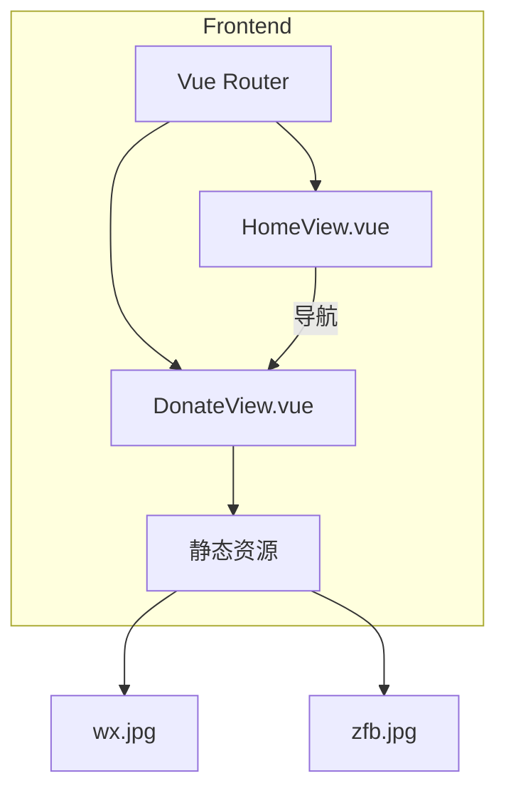

# 设计文档

## 概述

捐赠支持功能是一个纯前端页面，用于展示开发者的收款方式和助力链接。该功能不涉及后端 API，仅需要创建一个新的 Vue 视图组件和配置路由。

## 架构



## 组件和接口

### DonateView 组件

捐赠支持页面的主视图组件。

```typescript
// frontend/src/views/DonateView.vue
interface DonateView {
  // 组件无需 props 或 state
  // 纯展示型组件
}
```

### 路由配置

```typescript
// 新增路由配置
{
  path: "/donate",
  name: "Donate",
  component: () => import("@/views/DonateView.vue"),
  meta: { requiresAuth: false }  // 捐赠页面无需登录即可访问
}
```

## 数据模型

该功能不涉及数据模型，所有内容为静态展示。

### 静态资源

| 资源         | 路径                      | 用途           |
| ------------ | ------------------------- | -------------- |
| 微信收款码   | `@/assets/images/wx.jpg`  | 微信扫码支付   |
| 支付宝收款码 | `@/assets/images/zfb.jpg` | 支付宝扫码支付 |

### 外部链接

| 链接       | URL                                        | 用途     |
| ---------- | ------------------------------------------ | -------- |
| MakerWorld | https://makerworld.com.cn/zh/@ganxiaochuan | 平台助力 |

## 正确性属性

_正确性属性是指在系统所有有效执行中都应保持为真的特征或行为——本质上是关于系统应该做什么的形式化陈述。_

由于该功能是纯展示型的前端页面，不涉及复杂的业务逻辑或数据处理，大部分验收标准都是 UI 元素存在性测试，适合通过示例测试（example tests）而非属性测试（property tests）来验证。

### 属性分析

经过对验收标准的分析，该功能的测试主要集中在：

- UI 元素存在性验证（示例测试）
- 路由配置正确性（示例测试）
- 链接属性正确性（示例测试）

由于没有涉及数据转换、序列化、或需要对多种输入进行验证的业务逻辑，因此不需要属性测试。

## 错误处理

该功能为纯静态展示页面，错误处理场景有限：

1. **图片加载失败**: 使用 CSS 设置占位背景或 alt 文本
2. **外部链接不可用**: 用户自行处理，无需系统干预

## 测试策略

### 单元测试

由于该功能是纯展示型组件，测试重点在于：

1. **组件渲染测试**

   - 验证 DonateView 组件能正确渲染
   - 验证三个支持方式卡片都存在
   - 验证微信和支付宝二维码图片正确引用
   - 验证 MakerWorld 链接正确配置

2. **路由测试**
   - 验证 `/donate` 路由正确配置
   - 验证从首页可以导航到捐赠页面

### 测试框架

使用 Vue Test Utils 和 Vitest 进行组件测试。

## UI 设计

### 页面布局

```
+------------------------------------------+
|  3D打印耗材管理系统          [用户名] [退出] |
+------------------------------------------+
|                                          |
|  < 返回首页                               |
|                                          |
|  ❤️ 支持开发者                            |
|                                          |
|  感谢您使用本系统！如果觉得有帮助，          |
|  欢迎通过以下方式支持我：                   |
|                                          |
|  +----------+  +----------+  +----------+ |
|  |  微信    |  |  支付宝  |  | MakerWorld| |
|  |  [QR]   |  |  [QR]   |  |   [图标]   | |
|  | 微信支付 |  | 支付宝   |  |  去助力   | |
|  +----------+  +----------+  +----------+ |
|                                          |
+------------------------------------------+
```

### 样式规范

- 使用与系统一致的卡片样式
- 二维码图片尺寸：200x200px
- 卡片间距：1.5rem
- 响应式布局：移动端单列，桌面端三列
