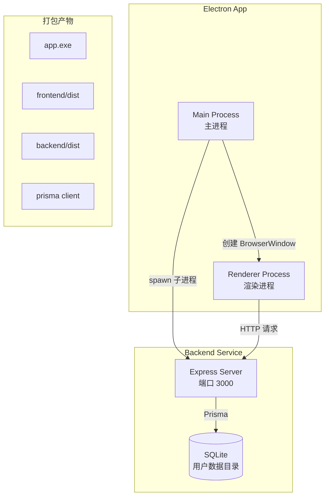
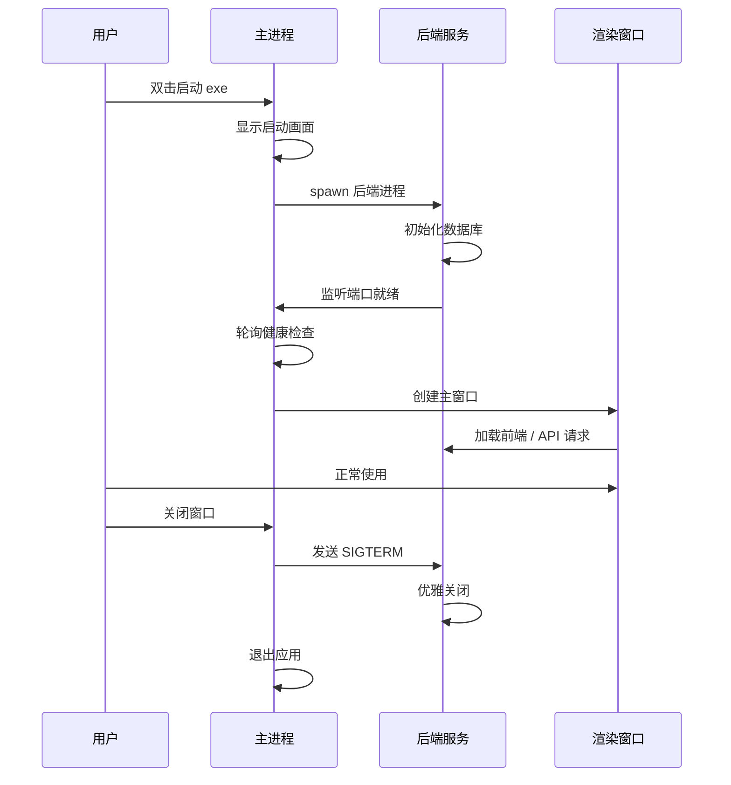

# 设计文档

## 概述

本设计描述如何为 3D 打印耗材管理系统添加 Electron 桌面应用支持。采用"Electron 壳 + 现有服务"的架构，在不修改现有前后端代码的前提下，创建一个独立的 Electron 项目来包装整个应用。

核心思路：

1. 创建独立的 `electron/` 目录
2. Electron 主进程负责启动后端服务（作为子进程）
3. 等待后端就绪后，在 BrowserWindow 中加载前端
4. 打包时将前端构建产物和后端代码一起打包

## 架构



### 运行流程



## 组件和接口

### 1. 项目结构

```
project-root/
├── electron/                    # 新增 Electron 项目
│   ├── package.json
│   ├── tsconfig.json
│   ├── electron-builder.yml     # 打包配置
│   ├── src/
│   │   ├── main.ts              # 主进程入口
│   │   ├── preload.ts           # 预加载脚本
│   │   └── backend-manager.ts   # 后端进程管理
│   └── resources/
│       └── icon.ico             # 应用图标
├── frontend/                    # 现有前端（不修改）
├── backend/                     # 现有后端（不修改）
└── scripts/
    └── build-electron.js        # 构建脚本
```

### 2. 主进程 (main.ts)

```typescript
interface AppConfig {
  backendPort: number;
  isDev: boolean;
  userDataPath: string;
}

// 主要职责：
// - 创建 BrowserWindow
// - 管理后端服务生命周期
// - 处理应用事件（ready, window-all-closed, activate）
```

### 3. 后端进程管理器 (backend-manager.ts)

```typescript
interface BackendManager {
  start(): Promise<void>; // 启动后端服务
  stop(): Promise<void>; // 停止后端服务
  waitForReady(): Promise<void>; // 等待服务就绪
  isRunning(): boolean; // 检查运行状态
}
```

### 4. 预加载脚本 (preload.ts)

```typescript
// 暴露给渲染进程的 API（如需要）
interface ElectronAPI {
  getAppVersion(): string;
  getPlatform(): string;
}
```

## 数据模型

### 环境配置

```typescript
// 开发模式
const devConfig = {
  backendUrl: "http://localhost:3000",
  frontendUrl: "http://localhost:5173",
  databasePath: "./backend/prisma/dev.db",
};

// 生产模式（打包后）
const prodConfig = {
  backendUrl: "http://localhost:3000",
  frontendUrl: null, // 从本地文件加载
  databasePath: path.join(app.getPath("userData"), "data.db"),
};
```

### 数据库路径策略

- 开发模式：使用 `backend/prisma/dev.db`
- 生产模式：使用 `%APPDATA%/3d-printing-consumables/data.db`
- 通过环境变量 `DATABASE_URL` 传递给后端进程

## 正确性属性

_正确性属性是指在系统所有有效执行中都应该保持为真的特征或行为——本质上是关于系统应该做什么的形式化陈述。_

由于本功能主要涉及进程管理和打包配置，大部分验收标准属于集成测试或手动验证范畴，不适合属性测试。以下是可测试的属性：

### Property 1: 后端健康检查响应格式

_对于任意_ 健康检查请求，后端服务应返回包含 `status`、`database` 和 `timestamp` 字段的 JSON 响应。

**验证: 需求 2.3**

### Property 2: 数据库路径解析

_对于任意_ 有效的用户数据目录路径，数据库路径解析函数应返回以 `.db` 结尾的绝对路径。

**验证: 需求 4.2**

## 错误处理

### 后端启动失败

```typescript
// 场景：端口被占用、数据库初始化失败等
// 处理：
// 1. 捕获子进程错误事件
// 2. 显示错误对话框
// 3. 提供"重试"和"退出"选项
```

### 后端意外退出

```typescript
// 场景：后端进程崩溃
// 处理：
// 1. 监听子进程 exit 事件
// 2. 尝试自动重启（最多 3 次）
// 3. 超过重试次数后显示错误并退出
```

### 窗口加载失败

```typescript
// 场景：前端资源加载失败
// 处理：
// 1. 监听 did-fail-load 事件
// 2. 显示错误页面
// 3. 提供刷新按钮
```

## 测试策略

### 单元测试

- 测试数据库路径解析逻辑
- 测试配置加载逻辑
- 测试健康检查轮询逻辑

### 集成测试

- 测试后端进程启动和关闭
- 测试窗口创建和加载
- 测试开发模式和生产模式切换

### 手动测试

- 测试打包后的 exe 文件
- 测试安装和卸载流程
- 测试在不同 Windows 版本上的兼容性

### 属性测试框架

使用 `fast-check` 进行属性测试（与现有后端测试保持一致）。

```typescript
// 示例：测试数据库路径解析
import fc from "fast-check";

test("数据库路径应为绝对路径且以 .db 结尾", () => {
  fc.assert(
    fc.property(fc.string(), (userDataDir) => {
      const dbPath = resolveDatabasePath(userDataDir);
      return path.isAbsolute(dbPath) && dbPath.endsWith(".db");
    })
  );
});
```
