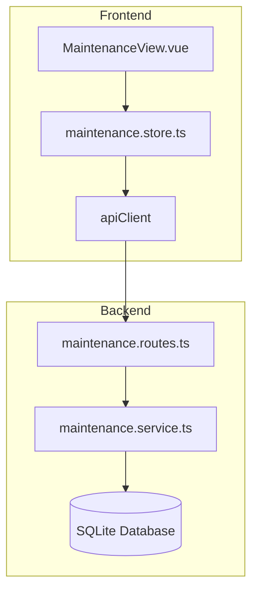

# Design Document: 保养记录模块

## Overview

本设计为 3D 打印耗材管理系统添加保养记录模块。用户可以记录打印机的保养时间、保养类型和保养内容，并可以回看、编辑和删除历史记录。

技术方案与现有系统保持一致：前端使用 Vue 3 + Pinia，后端使用 Express + Prisma + SQLite。

## Architecture



## Components and Interfaces

### 1. 数据库模型 (Prisma Schema)

```prisma
model MaintenanceRecord {
  id          String   @id @default(uuid())
  userId      String
  date        DateTime // 保养时间
  type        String   // 保养类型：cleaning, lubrication, replacement, calibration, other
  description String?  // 保养内容描述（可选）
  createdAt   DateTime @default(now())
  updatedAt   DateTime @updatedAt

  // Relations
  user User @relation(fields: [userId], references: [id], onDelete: Cascade)
}
```

### 2. 保养类型枚举

| 类型值      | 显示名称 | 说明                   |
| ----------- | -------- | ---------------------- |
| cleaning    | 清洁     | 清洁喷嘴、热床、导轨等 |
| lubrication | 润滑     | 润滑导轨、丝杆等       |
| replacement | 更换零件 | 更换喷嘴、皮带、轴承等 |
| calibration | 校准     | 调平、挤出量校准等     |
| other       | 其他     | 其他保养工作           |

### 3. 后端服务接口

```typescript
// maintenance.service.ts
interface MaintenanceRecordResponse {
  id: string;
  userId: string;
  date: Date;
  type: string;
  description: string | null;
  createdAt: Date;
  updatedAt: Date;
}

interface CreateMaintenanceData {
  date: Date;
  type: string;
  description?: string;
}

interface UpdateMaintenanceData {
  date?: Date;
  type?: string;
  description?: string;
}

class MaintenanceService {
  static async create(
    userId: string,
    data: CreateMaintenanceData
  ): Promise<MaintenanceRecordResponse>;
  static async findAllByUser(
    userId: string
  ): Promise<MaintenanceRecordResponse[]>;
  static async findById(
    userId: string,
    id: string
  ): Promise<MaintenanceRecordResponse>;
  static async update(
    userId: string,
    id: string,
    data: UpdateMaintenanceData
  ): Promise<MaintenanceRecordResponse>;
  static async delete(userId: string, id: string): Promise<void>;
}
```

### 4. API 路由

| Method | Endpoint               | Description          |
| ------ | ---------------------- | -------------------- |
| POST   | `/api/maintenance`     | 创建保养记录         |
| GET    | `/api/maintenance`     | 获取用户所有保养记录 |
| GET    | `/api/maintenance/:id` | 获取单个保养记录     |
| PUT    | `/api/maintenance/:id` | 更新保养记录         |
| DELETE | `/api/maintenance/:id` | 删除保养记录         |

### 5. 前端 Store

```typescript
// maintenance.store.ts
interface MaintenanceRecord {
  id: string;
  userId: string;
  date: string;
  type: string;
  description: string | null;
  createdAt: string;
  updatedAt: string;
}

interface MaintenanceFormData {
  date: string;
  type: string;
  description?: string;
}

interface MaintenanceStore {
  records: MaintenanceRecord[];
  isLoading: boolean;
  error: string | null;

  fetchRecords(): Promise<boolean>;
  createRecord(data: MaintenanceFormData): Promise<MaintenanceRecord | null>;
  updateRecord(
    id: string,
    data: MaintenanceFormData
  ): Promise<MaintenanceRecord | null>;
  deleteRecord(id: string): Promise<boolean>;
}
```

## Data Models

### MaintenanceRecord 实体

| Field       | Type     | Description          |
| ----------- | -------- | -------------------- |
| id          | UUID     | 主键                 |
| userId      | UUID     | 所属用户 ID（外键）  |
| date        | DateTime | 保养时间             |
| type        | String   | 保养类型             |
| description | String?  | 保养内容描述（可选） |
| createdAt   | DateTime | 创建时间             |
| updatedAt   | DateTime | 更新时间             |

## Correctness Properties

_A property is a characteristic or behavior that should hold true across all valid executions of a system-essentially, a formal statement about what the system should do. Properties serve as the bridge between human-readable specifications and machine-verifiable correctness guarantees._

### Property 1: 创建记录返回完整数据

_For any_ 有效的保养数据（包含日期和类型），创建记录后，返回的响应应包含 id、date、type、description、createdAt 字段，且值与输入一致。

**Validates: Requirements 1.1, 1.5**

### Property 2: 保养类型验证

_For any_ 有效的保养类型（cleaning、lubrication、replacement、calibration、other），系统都应接受并正确存储。

**Validates: Requirements 1.3**

### Property 3: 列表完整性与排序

_For any_ 用户，查询保养记录列表应返回所有已创建的记录，且按保养时间倒序排列（最新的在前）。

**Validates: Requirements 2.1, 2.2, 2.3**

### Property 4: 更新记录 Round-Trip

_For any_ 已存在的保养记录，更新后再查询应返回更新后的值。

**Validates: Requirements 3.2**

### Property 5: 删除移除记录

_For any_ 已存在的保养记录，删除后再查询应返回"记录不存在"错误。

**Validates: Requirements 4.2**

### Property 6: 用户数据隔离

_For any_ 两个不同的用户 A 和 B，用户 A 的保养记录不应出现在用户 B 的查询结果中，用户 B 也不能访问、修改或删除用户 A 的记录。

**Validates: Requirements 5.1, 5.2**

## Error Handling

| 场景           | HTTP Status | 错误信息                    |
| -------------- | ----------- | --------------------------- |
| 记录不存在     | 404         | Record not found            |
| 无权访问       | 403         | Access denied               |
| 缺少必填字段   | 400         | Field date/type is required |
| 无效的保养类型 | 400         | Invalid maintenance type    |

## Testing Strategy

### 单元测试

- 测试 MaintenanceService 的各个方法
- 测试输入验证逻辑
- 测试权限验证逻辑

### 属性测试

使用 fast-check 库进行属性测试：

- 每个属性测试运行至少 100 次迭代
- 测试标签格式：**Feature: maintenance-records, Property {number}: {property_text}**

### 测试框架

- 后端：Jest + fast-check
