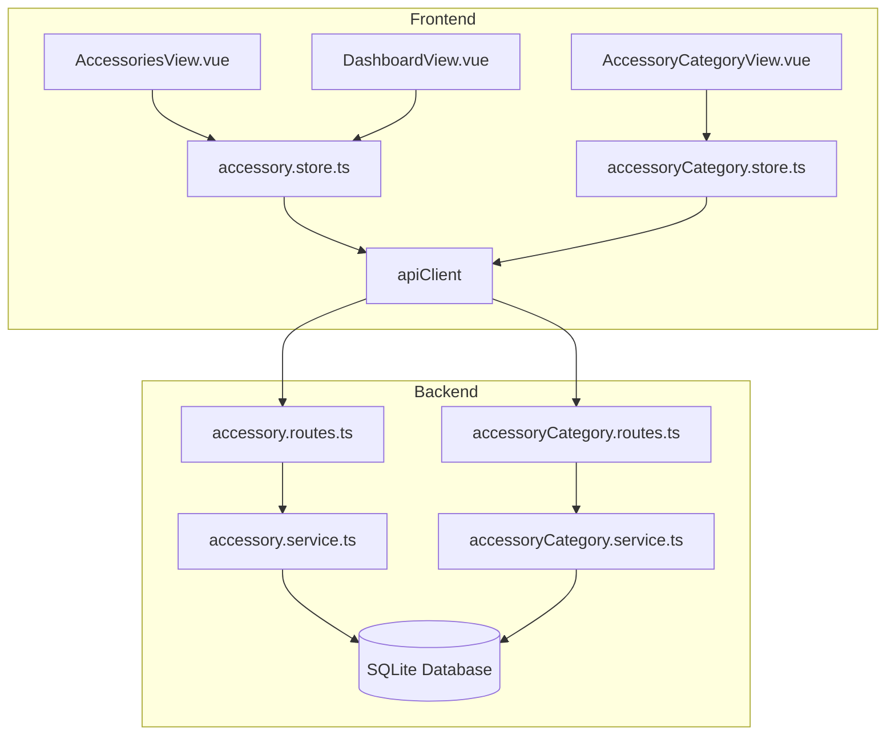

# Design Document: 打印机配件管理模块

## Overview

本设计为 3D 打印耗材管理系统添加打印机配件管理模块。用户可以管理打印机的各类配件（如打印板、润滑油、润滑脂、喷嘴、皮带等），记录配件的购买信息、使用状态、更换周期，并在配件需要更换或库存不足时获得提醒。

技术方案与现有系统保持一致：前端使用 Vue 3 + Pinia，后端使用 Express + Prisma + SQLite。

## Architecture



## Components and Interfaces

### 1. 数据库模型 (Prisma Schema)

```prisma
model AccessoryCategory {
  id          String   @id @default(uuid())
  userId      String?  // null 表示预设分类
  name        String
  description String?
  isPreset    Boolean  @default(false)
  createdAt   DateTime @default(now())
  updatedAt   DateTime @updatedAt

  // Relations
  user        User?        @relation(fields: [userId], references: [id], onDelete: Cascade)
  accessories Accessory[]

  @@unique([userId, name])
}

model Accessory {
  id               String    @id @default(uuid())
  userId           String
  categoryId       String
  name             String
  brand            String?   // 品牌/制造商
  model            String?   // 规格型号
  price            Float?    // 购买价格
  purchaseDate     DateTime? // 购买日期
  quantity         Int       @default(1)  // 数量
  remainingQty     Int       @default(1)  // 剩余数量
  replacementCycle Int?      // 建议更换周期（天数）
  lastReplacedAt   DateTime? // 上次更换时间
  lowStockThreshold Int?     // 库存不足阈值
  status           String    @default("available") // available, low_stock, depleted
  notes            String?   // 备注
  createdAt        DateTime  @default(now())
  updatedAt        DateTime  @updatedAt

  // Relations
  user        User              @relation(fields: [userId], references: [id], onDelete: Cascade)
  category    AccessoryCategory @relation(fields: [categoryId], references: [id], onDelete: Restrict)
  usageRecords AccessoryUsage[]
}

model AccessoryUsage {
  id          String   @id @default(uuid())
  userId      String
  accessoryId String
  usageDate   DateTime
  quantity    Int      // 使用数量
  purpose     String?  // 用途说明
  createdAt   DateTime @default(now())

  // Relations
  user      User      @relation(fields: [userId], references: [id], onDelete: Cascade)
  accessory Accessory @relation(fields: [accessoryId], references: [id], onDelete: Cascade)
}
```

### 2. 预设配件分类

| 分类名称 | 英文标识     | 说明                     |
| -------- | ------------ | ------------------------ |
| 打印板   | print_bed    | 热床板、PEI 板、玻璃板等 |
| 润滑剂   | lubricant    | 润滑油、润滑脂等         |
| 喷嘴     | nozzle       | 各种规格的打印喷嘴       |
| 传动部件 | transmission | 皮带、轴承、丝杆等       |
| 电子元件 | electronics  | 加热棒、热敏电阻、风扇等 |
| 其他     | other        | 其他配件                 |

### 3. 配件状态枚举

| 状态值    | 显示名称 | 说明             |
| --------- | -------- | ---------------- |
| available | 可用     | 库存充足         |
| low_stock | 库存不足 | 剩余数量低于阈值 |
| depleted  | 已用完   | 剩余数量为 0     |

### 4. 后端服务接口

#### AccessoryCategoryService

```typescript
interface AccessoryCategoryResponse {
  id: string;
  userId: string | null;
  name: string;
  description: string | null;
  isPreset: boolean;
  createdAt: Date;
  updatedAt: Date;
}

interface CreateCategoryData {
  name: string;
  description?: string;
}

class AccessoryCategoryService {
  static async getPresetCategories(): Promise<AccessoryCategoryResponse[]>;
  static async findAllByUser(
    userId: string
  ): Promise<AccessoryCategoryResponse[]>;
  static async create(
    userId: string,
    data: CreateCategoryData
  ): Promise<AccessoryCategoryResponse>;
  static async delete(userId: string, id: string): Promise<void>;
}
```

#### AccessoryService

```typescript
interface AccessoryResponse {
  id: string;
  userId: string;
  categoryId: string;
  name: string;
  brand: string | null;
  model: string | null;
  price: number | null;
  purchaseDate: Date | null;
  quantity: number;
  remainingQty: number;
  replacementCycle: number | null;
  lastReplacedAt: Date | null;
  lowStockThreshold: number | null;
  status: string;
  notes: string | null;
  createdAt: Date;
  updatedAt: Date;
  category?: { id: string; name: string };
  usageRecords?: AccessoryUsageResponse[];
}

interface CreateAccessoryData {
  categoryId: string;
  name: string;
  brand?: string;
  model?: string;
  price?: number;
  purchaseDate?: Date;
  quantity?: number;
  replacementCycle?: number;
  lowStockThreshold?: number;
  notes?: string;
}

interface UpdateAccessoryData {
  categoryId?: string;
  name?: string;
  brand?: string;
  model?: string;
  price?: number;
  purchaseDate?: Date;
  quantity?: number;
  remainingQty?: number;
  replacementCycle?: number;
  lastReplacedAt?: Date;
  lowStockThreshold?: number;
  notes?: string;
}

interface AccessoryFilters {
  categoryId?: string;
  status?: string;
}

class AccessoryService {
  static async create(
    userId: string,
    data: CreateAccessoryData
  ): Promise<AccessoryResponse>;
  static async findAllByUser(
    userId: string,
    filters?: AccessoryFilters
  ): Promise<AccessoryResponse[]>;
  static async findById(userId: string, id: string): Promise<AccessoryResponse>;
  static async update(
    userId: string,
    id: string,
    data: UpdateAccessoryData
  ): Promise<AccessoryResponse>;
  static async delete(userId: string, id: string): Promise<void>;
  static async recordUsage(
    userId: string,
    accessoryId: string,
    data: CreateUsageData
  ): Promise<AccessoryResponse>;
  static async getAlerts(userId: string): Promise<AccessoryAlert[]>;
}
```

#### AccessoryUsageService

```typescript
interface AccessoryUsageResponse {
  id: string;
  userId: string;
  accessoryId: string;
  usageDate: Date;
  quantity: number;
  purpose: string | null;
  createdAt: Date;
}

interface CreateUsageData {
  usageDate: Date;
  quantity: number;
  purpose?: string;
}

class AccessoryUsageService {
  static async create(
    userId: string,
    accessoryId: string,
    data: CreateUsageData
  ): Promise<AccessoryUsageResponse>;
  static async findByAccessory(
    userId: string,
    accessoryId: string
  ): Promise<AccessoryUsageResponse[]>;
}
```

### 5. API 路由

#### 配件分类路由

| Method | Endpoint                        | Description                 |
| ------ | ------------------------------- | --------------------------- |
| GET    | `/api/accessory-categories`     | 获取所有分类（预设+自定义） |
| POST   | `/api/accessory-categories`     | 创建自定义分类              |
| DELETE | `/api/accessory-categories/:id` | 删除自定义分类              |

#### 配件路由

| Method | Endpoint                     | Description      |
| ------ | ---------------------------- | ---------------- |
| POST   | `/api/accessories`           | 创建配件         |
| GET    | `/api/accessories`           | 获取用户所有配件 |
| GET    | `/api/accessories/:id`       | 获取单个配件详情 |
| PUT    | `/api/accessories/:id`       | 更新配件         |
| DELETE | `/api/accessories/:id`       | 删除配件         |
| POST   | `/api/accessories/:id/usage` | 记录配件使用     |
| GET    | `/api/accessories/alerts`    | 获取配件提醒     |

### 6. 前端 Store

#### accessoryCategory.store.ts

```typescript
interface AccessoryCategory {
  id: string;
  userId: string | null;
  name: string;
  description: string | null;
  isPreset: boolean;
}

interface AccessoryCategoryStore {
  categories: AccessoryCategory[];
  isLoading: boolean;
  error: string | null;

  fetchCategories(): Promise<boolean>;
  createCategory(data: {
    name: string;
    description?: string;
  }): Promise<AccessoryCategory | null>;
  deleteCategory(id: string): Promise<boolean>;
}
```

#### accessory.store.ts

```typescript
interface Accessory {
  id: string;
  userId: string;
  categoryId: string;
  name: string;
  brand: string | null;
  model: string | null;
  price: number | null;
  purchaseDate: string | null;
  quantity: number;
  remainingQty: number;
  replacementCycle: number | null;
  lastReplacedAt: string | null;
  lowStockThreshold: number | null;
  status: string;
  notes: string | null;
  category?: { id: string; name: string };
}

interface AccessoryFormData {
  categoryId: string;
  name: string;
  brand?: string;
  model?: string;
  price?: number;
  purchaseDate?: string;
  quantity?: number;
  replacementCycle?: number;
  lowStockThreshold?: number;
  notes?: string;
}

interface AccessoryStore {
  accessories: Accessory[];
  alerts: AccessoryAlert[];
  isLoading: boolean;
  error: string | null;

  fetchAccessories(filters?: {
    categoryId?: string;
    status?: string;
  }): Promise<boolean>;
  createAccessory(data: AccessoryFormData): Promise<Accessory | null>;
  updateAccessory(
    id: string,
    data: Partial<AccessoryFormData>
  ): Promise<Accessory | null>;
  deleteAccessory(id: string): Promise<boolean>;
  recordUsage(
    id: string,
    data: { usageDate: string; quantity: number; purpose?: string }
  ): Promise<boolean>;
  fetchAlerts(): Promise<boolean>;
}
```

## Data Models

### AccessoryCategory 实体

| Field       | Type     | Description                    |
| ----------- | -------- | ------------------------------ |
| id          | UUID     | 主键                           |
| userId      | UUID?    | 所属用户 ID（null 为预设分类） |
| name        | String   | 分类名称                       |
| description | String?  | 分类描述                       |
| isPreset    | Boolean  | 是否为预设分类                 |
| createdAt   | DateTime | 创建时间                       |
| updatedAt   | DateTime | 更新时间                       |

### Accessory 实体

| Field             | Type      | Description          |
| ----------------- | --------- | -------------------- |
| id                | UUID      | 主键                 |
| userId            | UUID      | 所属用户 ID          |
| categoryId        | UUID      | 分类 ID              |
| name              | String    | 配件名称             |
| brand             | String?   | 品牌/制造商          |
| model             | String?   | 规格型号             |
| price             | Float?    | 购买价格             |
| purchaseDate      | DateTime? | 购买日期             |
| quantity          | Int       | 总数量               |
| remainingQty      | Int       | 剩余数量             |
| replacementCycle  | Int?      | 建议更换周期（天数） |
| lastReplacedAt    | DateTime? | 上次更换时间         |
| lowStockThreshold | Int?      | 库存不足阈值         |
| status            | String    | 状态                 |
| notes             | String?   | 备注                 |
| createdAt         | DateTime  | 创建时间             |
| updatedAt         | DateTime  | 更新时间             |

### AccessoryUsage 实体

| Field       | Type     | Description |
| ----------- | -------- | ----------- |
| id          | UUID     | 主键        |
| userId      | UUID     | 所属用户 ID |
| accessoryId | UUID     | 配件 ID     |
| usageDate   | DateTime | 使用日期    |
| quantity    | Int      | 使用数量    |
| purpose     | String?  | 用途说明    |
| createdAt   | DateTime | 创建时间    |

## Correctness Properties

_A property is a characteristic or behavior that should hold true across all valid executions of a system-essentially, a formal statement about what the system should do. Properties serve as the bridge between human-readable specifications and machine-verifiable correctness guarantees._

### Property 1: 创建配件返回完整数据

_For any_ 有效的配件数据（包含名称和分类），创建配件后，返回的响应应包含所有字段（id、name、categoryId、quantity、remainingQty、status、notes 等），且值与输入一致。

**Validates: Requirements 2.1, 2.5**

### Property 2: 必填字段验证

_For any_ 配件创建请求，如果缺少名称或分类 ID，系统应拒绝创建并返回错误。

**Validates: Requirements 2.2, 2.3**

### Property 3: 列表查询完整性

_For any_ 用户，查询配件列表应返回所有已创建的配件，每个配件应包含名称、分类、数量、状态信息。

**Validates: Requirements 3.1, 3.2, 3.3**

### Property 4: 筛选功能正确性

_For any_ 配件列表和筛选条件（分类或状态），筛选结果中的所有配件都应满足筛选条件。

**Validates: Requirements 3.4**

### Property 5: 更新记录 Round-Trip

_For any_ 已存在的配件，更新后再查询应返回更新后的值。

**Validates: Requirements 4.2**

### Property 6: 删除移除记录

_For any_ 已存在的配件，删除后再查询应返回"记录不存在"错误。

**Validates: Requirements 5.2**

### Property 7: 使用记录更新数量和状态

_For any_ 配件使用记录，记录使用后剩余数量应等于原数量减去使用数量，且当剩余数量为 0 时状态应为"depleted"。

**Validates: Requirements 6.2, 6.3**

### Property 8: 使用历史完整性

_For any_ 配件，查询详情时应返回该配件的所有使用记录。

**Validates: Requirements 6.4**

### Property 9: 更换周期提醒计算

_For any_ 设置了更换周期的配件，如果距离上次更换时间超过更换周期，应出现在提醒列表中。

**Validates: Requirements 7.1**

### Property 10: 库存不足提醒计算

_For any_ 设置了库存阈值的配件，如果剩余数量低于阈值，应出现在提醒列表中。

**Validates: Requirements 7.2**

### Property 11: 用户数据隔离

_For any_ 两个不同的用户 A 和 B，用户 A 的配件数据不应出现在用户 B 的查询结果中，用户 B 也不能访问、修改或删除用户 A 的配件。

**Validates: Requirements 8.1, 8.2**

### Property 12: 分类删除约束

_For any_ 配件分类，如果该分类下存在配件，则删除操作应被拒绝。

**Validates: Requirements 1.4, 1.5**

### Property 13: 备注完整性

_For any_ 配件，查询详情时应完整返回备注内容。

**Validates: Requirements 9.2**

## Error Handling

| 场景             | HTTP Status | 错误信息                          |
| ---------------- | ----------- | --------------------------------- |
| 配件不存在       | 404         | Accessory not found               |
| 分类不存在       | 404         | Category not found                |
| 无权访问         | 403         | Access denied                     |
| 缺少必填字段     | 400         | Field name/categoryId is required |
| 分类下有配件     | 400         | Category has accessories          |
| 使用数量超过剩余 | 400         | Usage quantity exceeds remaining  |
| 不能删除预设分类 | 400         | Cannot delete preset category     |

## Testing Strategy

### 单元测试

- 测试 AccessoryService 的各个方法
- 测试 AccessoryCategoryService 的各个方法
- 测试输入验证逻辑
- 测试权限验证逻辑
- 测试状态自动更新逻辑

### 属性测试

使用 fast-check 库进行属性测试：

- 每个属性测试运行至少 100 次迭代
- 测试标签格式：**Feature: printer-accessories, Property {number}: {property_text}**

### 测试框架

- 后端：Jest + fast-check
